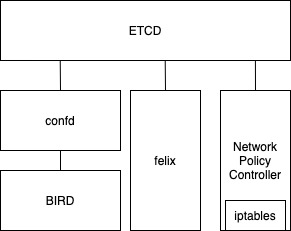

# Calico 网络方案

## 控制面架构及组件

- Felix, 负责在node上完成网络路由，ACL以及其他需要在node上执行的任务；基于不同的编排环境，主要负责：interface管理，Route管理，ACL，状态上报（网络状态上报到etcd）
- The Orchestrator plugin, 与编排系统紧密结合的一段代码，例如：Calico Neutron ML2 mechanism driver. 可以利用Neutron ML2 API来配置调用calico的功能
- confd, 轻量级配置管理工具，主要负责保持本地配置与中心存储一致。实现动态配置更新
- etcd, 存储calico必要的网络配置信息。并且协助calico各个组件间的通信
- BIRD, 完成BGP协议的执行，将必要的路由信息配置传达和接收到各个节点。BGP route reflector是面向更大规模集群来设计的（中心化路由分发）。为了解决单独的额BGP client带来的链接过多，需要维护过多路由的问题。
- Typha, option. 作为大规模集群时使用，用来减轻对KV datastore的压力。可以获取与felix无关的数据，并且减轻cpu压力。felix在大规模集群下十分消耗cpu资源。

## 数据面

Calico主要提供2中网络模式（backend）:

- BGP, 各个节点间网络扁平化，通过BGP协议（BGP Peer）进行路由同步，达到不同pod间互通的目的。
- Overlay Network, 支持vxlan

网络策略方面，大部分云厂商都使用calico的network policy实现来完成网络策略隔离方案。

## 不同场景对网络模式的选择

Networking Option | Suitable Environments | Dataplane Performance and Visibility | Setup Complexity | Notes
-----|------|-------|-------|-----
Calico, Unencapsulated, peered with physical infrastructure | On-prem | Best | Moderate | Allows pods to be directly accessed from outside the cluster
Calico, Unencapsulated, not peered with physical infrastructure | On-prem L2 networks, AWS, Azure | Best | Low | IP in IP or VXLAN can be added for cross-subnet traffic
Calico, Encapsulated, IPIP | On-prem, most public clouds other than Azure | Good to excellent depending on NIC hardware capabilities | Low |  
Calico, Encapsulated, VXLAN | On-prem, any public cloud | Good to excellent depending on NIC hardware capabilities | Low |  
AWS VPC CNI | Amazon EKS | Excellent | Low | Does not support full Calico IPAM feature set, limited to AWS.
Azure CNI | Microsoft AKS | Excellent | Low | Does not support full Calico IPAM feature set, limited to Azure.
Google cloud | Google GKE | Excellent | Low | Does not support full Calico IPAM feature set, limited to GCP.
Flannel | Any public cloud | Poor to excellent, depending on chosen backend | Medium | Does not support full Calico IPAM feature set.

进一步解释这里第1，2种case，以及encapsulated网络:

Option | Desc
-------|------
Unencapsulated, peered with physical infrastructure | 需要支持BGP协议的平台，calico会利用BGP进行路由同步
Unencapsulated, not peered with physical infrastructure | 需要整个calico维持的网络在一个单独L2 subnet中，并且关闭对报文中源ip的校验
IP in IP or VXLAN encapsulation | 对于underlay网络无法很好感知pod ip；或者需要跨vpc subnet构建网络时

## Networkpolicy

1. 使用calico api(projectcalico.org/v3), 配置文法与k8s相似但不同。
2. 支持多种action：allow, deny, log, pass
3. 支持多种协议：TCP, UDP, ICMP, SCTP, UDPlite, ICMPv6, protocol numbers (1-255)。
4. 支持http属性：但仅支持ingress。egress的任何限制暂不支持。规则中必须存在Allow条款。

## Reference

- [Calico architecture](https://docs.projectcalico.org/reference/architecture/overview)
- [Determine best networking option](https://docs.projectcalico.org/networking/determine-best-networking)
- [Network policy](https://docs.projectcalico.org/reference/resources/networkpolicy)
- [kubernetes指南 -- Calico](https://feisky.gitbooks.io/kubernetes/network/calico/calico.html)