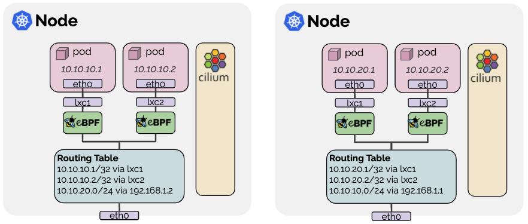

# Cilium 网络方案

## Cilium解决什么问题

- 面向微服务，很强的动态性，业务需要持续交付更新，服务间需要独立的ip且进行频繁交互
- 在成规模的容器集群中，ip作为易变的基础资源，对于微服务的服务治理会造成极大的负担：
  - 目前基于iptable实现的负载均衡和网络隔离策略，在微服务的网络环境下。可以说网络资源的变动是牵一发动全身的；
  - iptable的网络策略条目是庞大的，随着集群规模的增长，数据面的配置信息会大大限制整体编排系统的调度效率和业务资源的交付效率。
- 面对iptables的问题，给与更加快速的方案。
- 利用BPF提供清晰的网络试图，包括监控。
- 利用BPF提供隔离性更强的网络策略
- 面向更大规模的集群

## 功能概览

| 功能 |
|------|
| 支持的L7协议：更细粒度的应用层协议控制，例如：REST/HTTP, gRPC, Kafka。| 
| 内部容器或服务间安全：利用身份方式，解决传统容器防火墙面对大规模集群下容器随机性调度后，所在节点的随机性带来的安全配置困难问题（配置需要随目标容器所在位置而变动） |
| ingress和egress的安全访问：传统的访问控制在CIDR范围上来限制ingress和egress；Cilium提供容器应用级别IP段来限制 |
| 网络backend：overlay网络（vxlan和geneve）以及路由模式，每个host有固定的IP Range |
| 负载均衡：基于BPF 哈希表实现的负载均衡支持DSR，更加高效 |
| 监控和排障：针对被丢弃的报文，告警上原目的更多信息被展示；基于策略的全链路跟踪，可视化观察完整网络拓扑；监控指标支持promethues |
| 兼容性和集成：与k8s的network policy, label, ingress, service, cni,  docker的libnetwork完好对接 |

## 核心组件

组件 | 作用
----|------
Cilium Agent | 用来和上层编排系统做交互，完成：Container IP资源分配; 基于metadata识别的安全策略并生成BPF代码下发至kernel；API可描述查询当前节点容器的通信关系包括转发和过滤行为，以及它们的监控数据；利用Clang和LLVM，生成BPF代码下发kernel来配置container veth设备监控行为。
Linux Kernel BPF | Berkeley Packet Filter (BPF) 是linux一种用来做网络报文的bytecode解释器，例如，tcpdump和socket filter。原理是利用JIT动态编译，将BPF代码解读成CPU可读的机器码，实现动态报文处理，过滤，封装，转发等等。目前易扩展到其他方面包括：incoming packets, outgoing packets, system calls, kprobes等等。已确认4.9.x版本kernel支持了稳定版BPF。
Key-Value Store | 用来完成策略身份的记录，是一组列表；全局service，有全局ID和VIP对应；封装VTEP映射。一般复用etcd的能力
Cilium Operator | 一个集群只有一个，负责规模扩展（ nodes > 1000）；主要职责：为cluster mesh同步k8s service信息；同步节点资源；确保cilium管理的DNS pod; 垃圾回收一些cilium endpoint资源，不用的安全策略；翻译策略信息；与AWS ENI服务集成，做AWS API交互；上报cilium networkpolicy 状态给整个集群
Container Platform Network Plugin | 实现k8s docker的外部网络集成方案，CNI，libnetwork（cilium-docker）。

## 网络Backend数据面解读

### Native-Routing

图中展示的是L3路由方式，有时需要借助BGP实现集群动态伸缩带来的网络数据面变动

### GKE Networking

GKE的网络模式是为集群分配L2层打通的网络,利用[Alias IP Range](https://cloud.google.com/vpc/docs/alias-ip)（一个子网按ip段分配EIP），类似于同subnet下host-gw（direct routing模式）。借助BPF完成LB和networkpolicy的能力

### 网络地址管理

- host Scope：每个node只需要关心自己本地ip资源的管理接口，其他node无需关心。每个node一个独立的cidr。
- CRD-Backed: 利用custom resource definition来记录可用ip和已使用ip。
- AWS ENI: 多网卡弹性IP方案，也可以说利用云平台的ENI和EIP来支持ip资源管理。有ip资源的水位管理来避免并发访问带来的不必要的限流。
- Google Kubernetes Engine: 类似于L2方案，纯native route方式。单网卡弹性ip方案。每个节点规划自己的podcidr.

## 多集群网络设计

cilium提出cluster mesh概念，为了保证cilium的各种策略对上层透明且易于配置。例如k8s，cilium利用annotation完成对LB，policy的定义。此外，多集群容器间通信和外部服务ingress和egress的问题。cilium分别针对direct/native route和overlay network做了阐述：

1. Direct/Native Route 集群内部需要建立路由子系统（例如边界网关）来进行L3层转发。当然cilium至此将endpoint直接对外部集群暴露。
2. overlay 网络环境下，cilium与k8s一致需要类似ingress的LB来帮助完成service对外暴露。

## Cilium高效的安全

访问控制来自多个层次：L3, L4, L7。未来还会提供认证和加密。cilium利用BPF的亮点在于：

### 基于identity身份的访问控制和策略执行

核心问题：避免传统集群网络下和ip的关联关系——一个ip的变动会扰动整个集群，随之安全策略也需要全局变更。负担很重，影响资源交付和调度效率，而且会带来很多不必要和不易解释的网络异常

解决方案：利用label或其他标签类标识，将endpoints(vm, pod, container等)与identity label关联。在报文层面增加metadata，与网络报文（主要是IP）解耦达到。安全策略不随网络变动而变动。

## 数据面BPF详解

## Cilium的多集群网络解决方案

## Reference

- [Documents for Cilium](https://docs.cilium.io/en/stable/intro/)
- [Deep Dive into Cilium Multi-cluster](https://cilium.io/blog/2019/03/12/clustermesh/)
