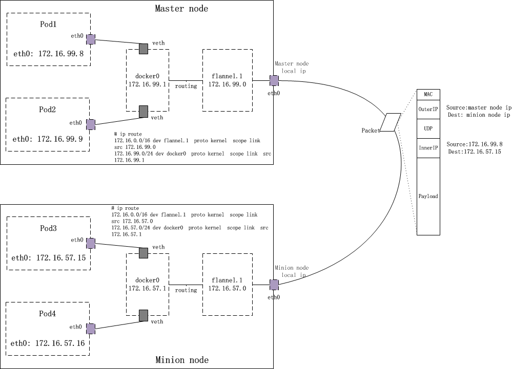

# Flannel原理

- udp：使用用户态udp封装，默认使用8285端口。由于是在用户态封装和解包，性能上有较大的损失
- vxlan：vxlan封装，需要配置VNI，Port（默认8472）和GBP
- host-gw：直接路由的方式，将容器网络的路由信息直接更新到主机的路由表中，仅适用于二层直接可达的网络
- aws-vpc：使用 Amazon VPC route table 创建路由，适用于AWS上运行的容器
- gce：使用Google Compute Engine Network创建路由，所有instance需要开启IP forwarding，适用于GCE上运行的容器
- ali-vpc：使用阿里云VPC route table 创建路由，适用于阿里云上运行的容器

## Host-GW


在每个node上配置到其他node 中pod subnet的子网路由，下一条指向对端的主网卡ip，从本地主网卡设备出去。

```bash
ip route list
default via 192.168.0.254 dev eth0 proto static metric 100
10.1.20.0/24 via 192.168.0.200 dev eth0
10.1.15.0/24 dev docker0 proto kernel scope link src 192.168.0.1
```

## vxlan 网络



各个node上的网络设备列表新增一个名为flannel.1的类型为vxlan的网络设备, 从flannel.1的设备信息来看，它似乎与eth0存在着某种bind关系。这是在其他bridge、veth设备描述信息中所没有的。

master node:

```bash
$ ip -d link show
4: flannel.1: <BROADCAST,MULTICAST,UP,LOWER_UP> mtu 1450 qdisc noqueue state UNKNOWN mode DEFAULT group default
    link/ether b6:bf:4c:81:cf:3b brd ff:ff:ff:ff:ff:ff promiscuity 0
    vxlan id 1 local {master node local ip} dev eth0 port 0 0 nolearning ageing 300
```

minion node:

```bash
349: flannel.1: <BROADCAST,MULTICAST,UP,LOWER_UP> mtu 1450 qdisc noqueue state UNKNOWN mode DEFAULT group default
    link/ether d6:51:2e:80:5c:69 brd ff:ff:ff:ff:ff:ff promiscuity 0
    vxlan id 1 local  {minion node local ip} dev eth0 port 0 0 nolearning ageing 300
```

### pod1访问pod3的关键路径

- docker0发出的报文根据节点路由找到flannel.1

172.16.0.0/16 dev flannel.1  proto kernel  scope link  src 172.16.99.0
172.16.99.0/24 dev docker0  proto kernel  scope link  src 172.16.99.1

- flannel.1收到数据包后，由于自己不是目的地，也要尝试将数据包重新发送出去。数据包沿着网络协议栈向下流动，在二层时需要封二层以太包，填写目的mac地址，这时一般应该发出arp：”who is 172.16.57.15″。但vxlan设备的特殊性就在于它并没有真正在二层发出这个arp包，因为下面的这个内核参数设置, 而是由linux kernel引发一个”L3 MISS”事件并将arp请求发到用户空间的flanned程序。

master node:

```bash
$ cat /proc/sys/net/ipv4/neigh/flannel.1/app_solicit
3
```

- flanned程序收到”L3 MISS”内核事件以及arp请求(who is 172.16.57.15)后，并不会向外网发送arp request，而是尝试从etcd查找该地址匹配的子网的vtep信息。在前面章节我们曾经展示过etcd中Flannel network的配置信息, flanneld从etcd中找到了答案：

master node:

```bash
$ etcdctl --endpoints http://127.0.0.1:{etcd listen port} ls  /coreos.com/network/subnets
/coreos.com/network/subnets/172.16.99.0-24
/coreos.com/network/subnets/172.16.57.0-24

$ curl -L http://127.0.0.1:{etcd listen port}/v2/keys/coreos.com/network/subnets/172.16.57.0-24
{"action":"get","node":{"key":"/coreos.com/network/subnets/172.16.57.0-24","value":"{\"PublicIP\":\"{minion node local ip}\",\"BackendType\":\"vxlan\",\"BackendData\":{\"VtepMAC\":\"d6:51:2e:80:5c:69\"}}","expiration":"2017-01-17T09:46:20.607339725Z","ttl":21496,"modifiedIndex":2275460,"createdIndex":2275460}}
```

- 接下来，flanned将查询到的信息放入master node host的arp cache表中：

master node:

```bash
$ ip neighbour |grep 172.16.57.15
172.16.57.15 dev flannel.1 lladdr d6:51:2e:80:5c:69 REACHABLE
```

- flanneld完成这项工作后，linux kernel就可以在arp table中找到 172.16.57.15对应的mac地址并封装二层以太包了。不过这个封包还不能在物理网络上传输，因为它实际上只是vxlan tunnel上的packet。
- kernel 对 vxlan封包：flannel.1为vxlan设备，linux kernel可以自动识别，并将上面的packet进行vxlan封包处理。在这个封包过程中，kernel需要知道该数据包究竟发到哪个node上去。kernel需要查看node上的fdb(forwarding database)以获得上面对端vtep设备（已经从arp table中查到其mac地址：d6:51:2e:80:5c:69）所在的node地址。如果fdb中没有这个信息，那么kernel会向用户空间的flanned程序发起”L2 MISS”事件。flanneld收到该事件后，会查询etcd，获取该vtep设备对应的node的”Public IP“，并将信息注册到fdb中。

master node:

```bash
$ bridge fdb show dev flannel.1|grep d6:51:2e:80:5c:69
d6:51:2e:80:5c:69 dst {minion node local ip} self permanent
```

- 由于目标ip是minion node，查找路由表，包应该从master node的eth0发出，这样src ip和src mac地址也就确定了。
- minion node上的eth0接收到上述vxlan包，kernel将识别出这是一个vxlan包，于是拆包后将flannel.1 packet转给minion node上的vtep（flannel.1）。minion node上的flannel.1再将这个数据包转到minion node上的docker0，继而由docker0传输到Pod3的某个容器里。

### pod访问外网关键路径

主要是通过docker引擎在iptables的POSTROUTING chain中设置的MASQUERADE规则, docker将容器的pod network地址伪装为node ip出去，包回来时再snat回容器的pod network地址，这样网络就通了。

mastre node:

```bash
$ iptables -t nat -nL
... ...
Chain POSTROUTING (policy ACCEPT)
target     prot opt source               destination
MASQUERADE  all  --  172.16.99.0/24       0.0.0.0/0
... ...
```

## 优缺点对比

backend | host-gw | vxlan
--|-----|-----
配置安装 | 良好 | 良好 |
ip资源利用率 | 差 | 差
弹性 | 差，每个node上pod子网络需要提前规划 | 差，每个node上pod子网络需要提前规划
与云平台集成 | 良好 | 良好
运维 | 良好 | 差，详述请见[vxlan对zero-downtime restart的支持](#vxlan模式对zero-downtime-restarts支持不好)
性能 | 良好 | 差

### VXLAN模式对zero-downtime restarts支持

> When running with a backend other than udp, the kernel is providing the data path with flanneld acting as the control plane. As such, flanneld can be restarted (even to do an upgrade) without disturbing existing flows. However in the case of vxlan backend, this needs to be done within a few seconds as ARP entries can start to timeout requiring the flannel daemon to refresh them. Also, to avoid interruptions during restart, the configuration must not be changed (e.g. VNI, --iface values).

## Reference

- [flannel documents -- Backends](https://github.com/coreos/flannel/blob/master/Documentation/backends.md)
- [Kubernetes中的网络解析——以flannel为例](https://jimmysong.io/kubernetes-handbook/concepts/flannel.html)
- [kubernetes指南 flannel](https://kubernetes.feisky.xyz/extension/network/flannel)
- [理解Kubernetes网络之Flannel网络](https://tonybai.com/2017/01/17/understanding-flannel-network-for-kubernetes/)