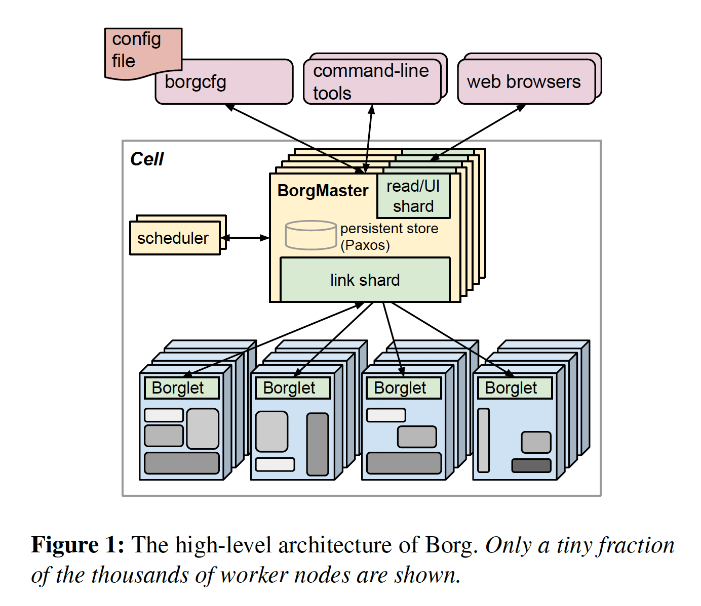
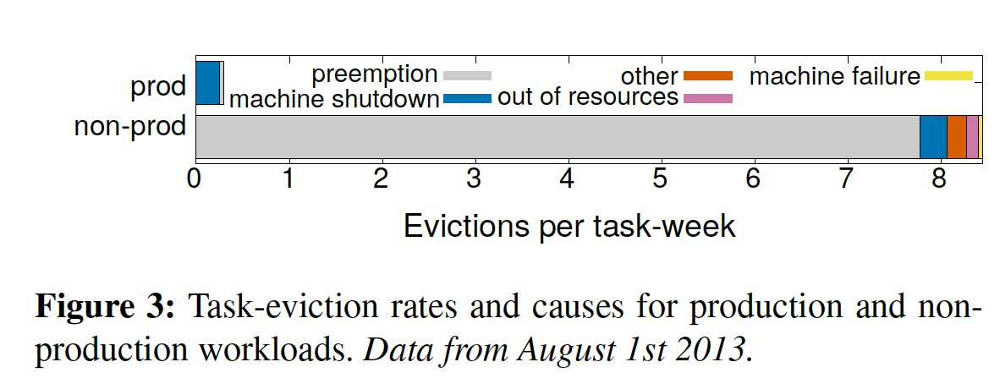
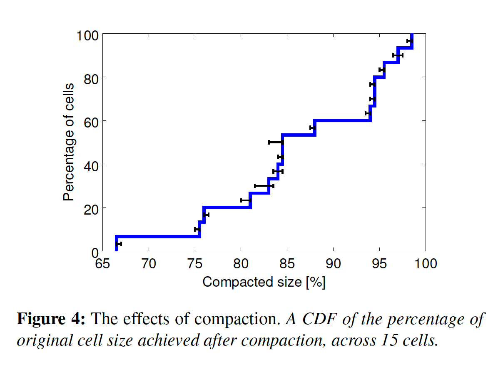
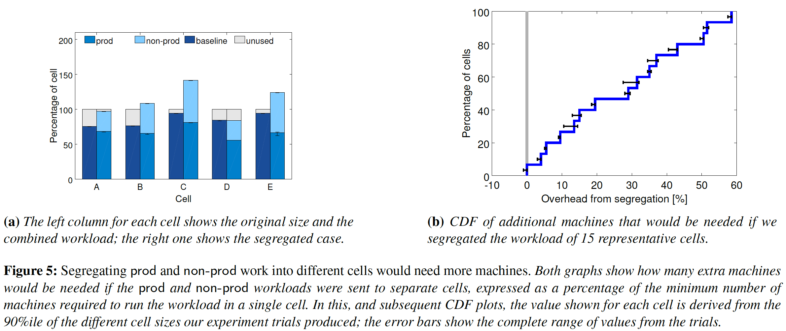
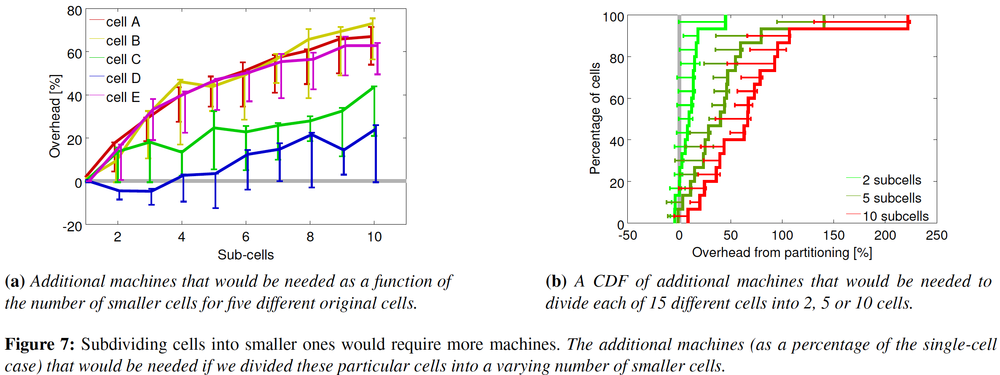
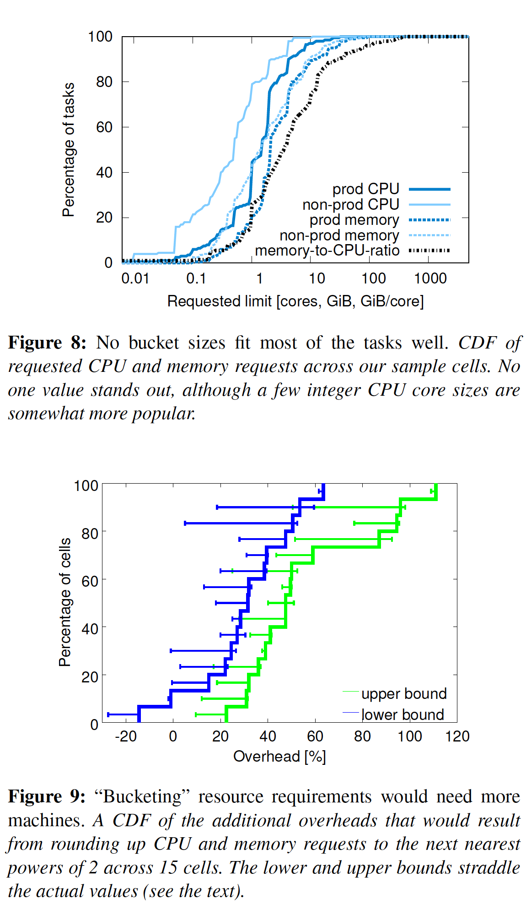
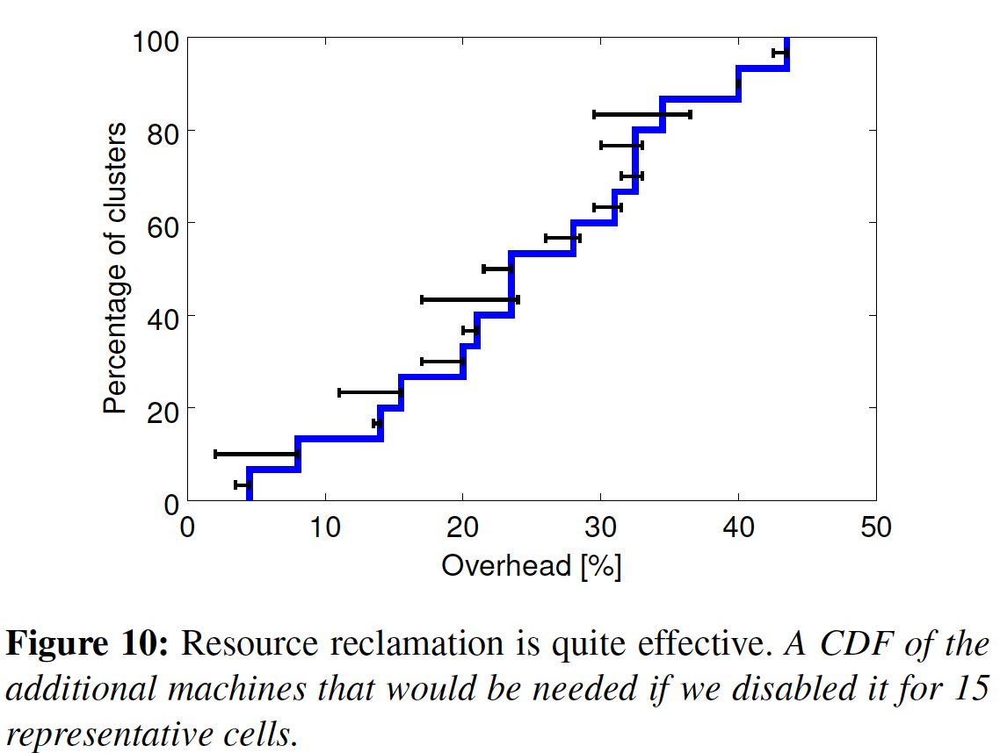
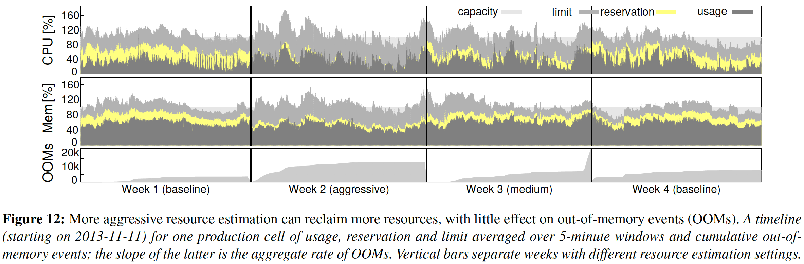

# Blog 学习总结和思考

<!-- TOC -->

- [Blog 学习总结和思考](#blog-学习总结和思考)
  - [0 核心点写在前面](#0-核心点写在前面)
    - [0.1 Borg解决的问题和意义](#01-borg解决的问题和意义)
    - [0.2 感兴趣的核心问题](#02-感兴趣的核心问题)
      - [0.2.1 资源调度](#021-资源调度)
      - [0.2.2 资源利用率](#022-资源利用率)
        - [0.2.2.1 “超卖”——资源回收](#0221-超卖资源回收)
      - [0.2.3 隔离性](#023-隔离性)
    - [0.3 Next Borg带来的收益](#03-next-borg带来的收益)
    - [0.4 Borg仿真器](#04-borg仿真器)
  - [1 用户场景和需求](#1-用户场景和需求)
  - [2 架构设计](#2-架构设计)
    - [2.1 BorgMaster](#21-borgmaster)
    - [2.2 Scheduling](#22-scheduling)
      - [2.2.1 调度分配策略](#221-调度分配策略)
    - [2.3 Borglet](#23-borglet)
    - [2.4 架构可扩展性](#24-架构可扩展性)
    - [2.5 可靠性保障](#25-可靠性保障)
  - [3 资源利用率](#3-资源利用率)
    - [3.1 压缩cell规模](#31-压缩cell规模)
    - [3.2 Cell共享](#32-cell共享)
      - [3.2.1 cpu执行指令效率的问题](#321-cpu执行指令效率的问题)
    - [3.3 Large Cells](#33-large-cells)
    - [3.4 精细化资源分配的优势](#34-精细化资源分配的优势)
  - [4 资源回收](#4-资源回收)
  - [5 隔离性](#5-隔离性)
  - [6 Borg在2011和2019两个版本上的变化](#6-borg在2011和2019两个版本上的变化)
    - [6.1 从数据中看出Borg的收益](#61-从数据中看出borg的收益)
      - [6.1.1 关注成本优化](#611-关注成本优化)
      - [6.1.2 调度延迟分析](#612-调度延迟分析)
  - [8 Reference](#8-reference)

<!-- /TOC -->

> 以下内容均来自*Large-scale cluster management at Google with Borg*，通过阅读文章，总结和梳理了在面对大规模集群设计时所要考虑的方方面面。对充分理解kubernetes设计背景和当前主要开发和维护的IaaS云平台有很多借鉴意义。但在学习中也要注意Borg并不是面向IaaS平面的资源管理系统，需注意区分场景和需求的不同

## 0 核心点写在前面

文章过长，核心点写在前面。其他详细可深入阅读。

### 0.1 Borg解决的问题和意义

- 与大多数分布式计算集群一样，Borg提供了大规模分布式计算能力。核心特点：准入控制，高效任务分发和调度，业务资源隔离，声明式任务下发，服务发现，监控，分析和模拟工具。高可用，易扩展，屏蔽底层硬件差异化，管理大规模节点群，提升资源利用率。
- 2019 Borg文中主要阐述了集群数据分析方法和结论。主要针对成本优化和资源调度延迟2个问题进行了数据分析。

### 0.2 感兴趣的核心问题

#### 0.2.1 资源调度

- scheduler架构上与BorgMaster分离。异步扫描需要调度的tasks。
- 调度时优先可用节点筛选（feasibility checking），然后打分（scoring）选出最优节点进行调度。
- 面对大量需要调度的各种类型tasks。调度方式上有如下优化：
  - 对评分进行缓存：对于borg而言，计算评分开销很大，只有变更时才刷新缓存。
  - 等效类别：对具有相同特点的task进行统一评分计算。
  - 宽松随机化：乱序筛选部分节点进行可行性分析和评分，加速task调度效率。
  - 多调度器并行处理：参考omega

#### 0.2.2 资源利用率

评估资源利用率优劣的方法：集群可压缩程度（同等负载情况下，集群规模越小，资源利用率越高）

为了达到更高的集群压缩率，Borg提供了一些手段：

- 1）集群资源共享（混合部署）；
- 2）精细化资源可分配单位

实测发现更大的集群调度有效性更强，资源利用率更好；

“超卖”资源后，有CPI（cycle per instruction）执行慢的问题，相对于成本节约上带来的收益，影响不大，不需要关注

##### 0.2.2.1 “超卖”——资源回收

生产环境下实际资源利用情况并不高，为了达到“超卖”效果，Borg做了“资源回收”，具体要点：

1. BorgMaster每隔几秒便会利用从Borglet捕获的细粒度使用率（资源消费），对预留值进行计算。
2. 最初的预留值被设为资源的请求量（即资源上限）
3. 300s的启动阶段之后，预留值会缓慢下降到实际用量加上安全余量。
4. 当实际用量超过预留值时，borgMaster会重新计算预留值，迅速上升。

- 调度器对生产（Guaranteed）job按照其申请的资源上限（limit）作为调度依据。不会列入超卖范畴
- 调度器对非生产(非Guaranteed)job按照按照计算所得预留值进行调度和分配。因此一部分资源可以回收
- 如果预留值计算有误（预测不准，异常情况等等）。BorgMaster会压制非生产job。kill或强制limit其资源使用上限。以保证其他生产task的正常运行。

#### 0.2.3 隔离性

保证LS task （latency sensitive）的运行平稳, Borg做了一些深度设计：

- 为了减少LS task被CFS频繁切换调度而带来的性能影响，Borg专门对LS task做了优化，可以在CFS下对批处理task做抢占。
- Borg还对Numa做了超线程敏感处理。
- 感知功耗的超线程管理和cpu管理

### 0.3 Next Borg带来的收益

资源利用率和调度延迟问题直接请见第[6](#6-borg在2011和2019两个版本上的变化)小节。

此外，Next Borg相对于2011 Borg主要变化：

1. 对任务终止做了更多的描述。正常退出，被kill，异常退出，被驱逐。统计了异常退出和kill的具体原因
2. 对任务状态转换做了统计，以此来分析业务的具体运行情况
3. Next Borg利用autopilot实现了超卖。

### 0.4 Borg仿真器

fauxMaster用来仿真borgMaster行为，得以反复复现和测试Borg系统。对于分析Borg系统调度有效性和实际价值有很大意义。

## 1 用户场景和需求

Borg所面临的用户场景和需求，Borg文章在最后也补充到很多需求都是面向SRE的，在Google 很多服务，平台的主要的设计和开发人员都是SRE

不同维度 | 描述
--------|--------
集群规模 | cell为单位，一个cluster由一个大型cell和若干个测试和特别用途的小型cell组成。一个中等cell 规模等价于 1W个machine
负载形式 | 常驻进程和批处理任务，使用容器做计算单元。不使用VM，避免虚拟化带来不必要的成本消耗
资源消耗 | 据borg研究观察表明，任务的cpu平均实际使用占申请上限85%， memory平均实际使用占申请上限64%
任务形态 | 一个 job 由多个 tasks（processes）组成. 一个job会分布在多个machine上。隶属于一个cell。
任务优先级控制 | 通过优先级来表达任务的被调度并运行的重要程度；高优先常驻任务有抢占批处理任务特点。批处理任务优先级也最低。任务优先级有助于提升重要业务的可靠性
任务准入控制 | quota作为准入控制的一环。约束资源（CPU, MEM，Disk等）的用量。常驻进程申请资源时如果不足，那么直接拒绝提交。同时支持优先级为0的批处理任务无限次提交。为了填补利用常驻进程空闲下来的资源。提高资源利用率
服务发现 | BNS服务, 使用FQDN方式命名服务，基本协议走RPC
监控 | 支持服务探测，健康检查来报告SLO （service level objective）。通过对job的监视，提出why pending的解释（面向SRE），以帮助debug，例如资源不足，需要重新分配资源，重新调度等等

此外，Borg在研究中还提及了一些潜在内部需求：

1. 资源池资源利用率提升
2. 集群可扩展性
3. 任务运行的可靠性保证
4. 安全和性能上的隔离保证

对比IaaS云平台还有如下场景和需求：

1. 计算单元的交付是虚拟机
2. 满足多种实例规格，突发型，竞争型，绑核实例，共享实例，裸金属等等
3. 多集群管控，缓解控制平面对数据库压力

## 2 架构设计

borg master和多个borglet组成

### 2.1 BorgMaster

- 接收API请求
- 运行时有5个副本，副本中维护了多个状态拷贝。这些拷贝记录在一个基于paxos的集群里
- borgMaster基于一个paxos集群做master选举，master可以做写操作。其他slave支持读操作
- borgMaster当发生主宕机时，会触发重新选举，大约10s-60s, 因为副本进程需要恢复内存数据。
- borgMaster的实体组成：主进程+调度进程
- 为了协助集群测试和debug重现线上故障，fauxmaster可以读取持久化数据，然后重放故障时的场景

### 2.2 Scheduling

调度器会异步地扫描队列，如果有足够的资源且符合job的约束，它会将tasks赋给机器。（调度器主要操作tasks而不是jobs）。扫描会遵循从高到低的优先级，同一级别优先级下的会采用轮转法来保证不同用户之间的公平性，以避免队首大型任务阻塞。调度算法主要考虑2个方面：

- feasibility checking: 满足调度条件的节点，维度包括：
  - 资源是否充足；
  - 是否可以抢占；
  - 总而言之，可行性检查是一些task对调度的强制约束。
- scoring: 将可调度节点按照一定策略进行评分。考虑以下几点：
  - 基于用户需求的评分策略，利用内置扩展驱动来具体实现，例如：task有些前置依赖，候选节点中已经具备。例如：镜像，包依赖等。tasks需要分散在不同故障域中；为了提升资源利用率，进行节点集中调度。等等；
  - 总而言之，评分筛选是task对调度的一种亲和性选择。

#### 2.2.1 调度分配策略

分析最佳和最差匹配的优劣（最优最差是站在调度成功率角度来说的），Borg采用混合分配模式：

1. 最差匹配：e-pvm实现分配，即每个节点均衡分配。但会导致大资源消耗的task无法分配。
2. 最佳匹配：尽量充分利用一个整机资源，分配完成后，再分配下一个。但这个会导致某些业务的突增性能无法达到。
3. Borg采用混合分配模式，混合模式为了解决搁浅资源（该节点已经被分配了所有资源，但是实际上task并未充分利用）。混合分配方式比最佳匹配提高了3-5%整合效率。

### 2.3 Borglet

- 负责tasks的管理
- 收集报告本地节点相关状态。由borgMaster来轮训收集（避免负载的流量控制机制和启动风暴）
- master做了切分，不同的副本会均分链接一起轮训borglet，当发生扩展，这个链接会动态变化。只采集增量的数据变化
- borgMaster对于“宕机”的borglet，会触发task重新调度。而borglet如果发现和borgMaster失去联系，它继续完成自己的task管理。如果能联系上borgMaster那么一定会有2个情况，一个是不用再重复调度task，另一个是清理该borglet管理的task，再重新调度

### 2.4 架构可扩展性

为了支持更大规模的cell, 在架构上，调度系统和borgMaster分离。在功能上，调度与其他功能可以并行。交互上：

1. 调度器主动向borgMaster获取状态变更（已分配和等待的task），持久化后，并进行调度划分。
2. 通知borgMaster，borgMaster接收到任务后，应用调度结果，开始下发任务。
3. 如果此时发现无法下发任务（资源不够），则等待下一轮被重新调度。这是**乐观锁调度方式**。

Borg有对不同负载使用不同调度器的功能，但并未深入介绍。此外，borg使用多线程对borglet进行通信，增加并发度，提升调度效率。个人理解Borg这里基于不同workload做不同的调度行为的实现思想，在kubernetes的scheduler extension points中可以体现。以插件的形式实现

为了优化调度可扩展性，有以下措施：

- 对评分进行缓存：对于borg而言，计算评分开销很大，只有变更时才刷新缓存。
- 等效类别：对具有相同特点的task进行统一评分计算。
- 宽松随机化：乱序筛选部分节点进行可行性分析和评分，加速task调度效率。

borg在调度整个cell需要花费几百秒，当不做以上优化时，需要超过3天的调度运算。

### 2.5 可靠性保障

可靠性表现上，根据borg的统计，大部分都是抢占行为带来的task退出；服务器宕机，关机，硬件故障带来的影响并不大。还有少量的资源不够导致的退出。

但对于IaaS云平台不提供竞价性实例的情况下，“抢占”导致的退出并不存在。因此大头在机器故障和意外异常宕机。增强可靠性措施，IaaS云平台与borg对比：

Borg | IaaS云平台
-----|------
自动对退出的任务重新调度，如果有必要的话将调度到新机器上。| 自动故障恢复系统，有时需要按策略人为介入判断，例如本地盘存在的情况
通过把一个job中的task传播至不同的可能失败域，例如不同机器，机架和供能域，来减少关联故障。 | Region, 多可用区，AG
操作系统/机器更新期间，限制允许的任务中断的速率以及job中同时失败的task数量。类似于k8s rolling update。| 操作系统/机器更新期间，实际情况依赖手动操作较多，借助集群API多副本和补偿机制保证任务派发正常
使用声明式预期状态表示和幂等的修改操作，这样故障的客户端就可以无损的重新提交遗漏的请求。| 同样支持幂等性
当机器不可用的时候限制tasks的重新调度速率，因为Borg不能区分大规模的机器故障和网络分区。| 对于单个机器进行了重新调度冷冻期的设置。或者考虑按照FD维度进行重新调度减少再次调度的概率
避免造成 “机器和task” 崩溃的组合再次出现。 | 同上一点的考虑。目前会切换其他物理机重新调度资源实例
通过不断地重新执行日志保存task，把写入本地硬盘的**关键**中间数据恢复，即使与日志关联的Alloc已经终止或转移到其他机器上了。用户可以指定系统重试的时长，通常设置为几天。| 不断polling和补偿机制
准入控制，减少资源使用过载 | API控制平面限制QPS，数据面资源隔离和绑定

整体对比来看，可靠性保障上，IaaS云平台与早期的borg差别不大。

## 3 资源利用率

borg通过资源压缩率和cell资源共享，2个角度进行了解释。

### 3.1 压缩cell规模

Borg使用集群规模可压缩率来评估，利用率的提升效果：保持一定的负载同时，压缩集群的机器数量。如下图所示，图中可见当cell资源使用情况保持在10%以下，20%左右，60%左右都呈现出较为弹性的可压缩空间。个人认为，cell压缩可以参考，但因业务场景而变。对于IaaS云平台资源管理调度系统，大部分成本来自于硬件（服务器中cpu, memory，GPU等）和数据中心设施（机架，场地，管理费用等）这部分成本一旦付出，不具有较为灵活的成本弹性。但集群的压缩率可以作为，提前规划的参考。但是，对于PaaS层面的业务，kubernetes等集群，利用IaaS云平台提供的弹性和低成本实例（竞价性，突发型，共享型实例）具有很好成本优化的借鉴意义。

### 3.2 Cell共享

下图是混合部署生产与非生产业务所呈现的cell规模对比。 混合要比不混合节省大概20%-30的机器成本。这一点对于kubernetes和IaaS云平台而言也是有不同的：

- kubernetes使用resource request和limit可以区别业务资源使用硬上限和软上限，从而依赖它们完成所谓“生产和非生产”的任务类型的调度部署。
- IaaS云平台为虚拟机调度时，需要根据虚拟机的工作负载来进行细化分析（对外承诺售卖的资源个数，例如2个vCPU = 2个超线程， 8GB mem = 8GB RAM，不可超卖，或不能让客户感知超卖），区分Guaranteed和BestEffort实例。目前来看，可以利用突发型，共享型，竞价性实例来填补常规实例的资源空缺。也就是Borg文档前面提到的“搁浅资源”。但这也大大增加了调度系统的设计难度

#### 3.2.1 cpu执行指令效率的问题

CPI（cycle per instruction）对于混合部署模式下，Borg文中称会影响cpu执行指令效率。专有资源池和混合资源池对比，cpu执行指令效率提升在5%以内，borglet指令执行效率提升1.19倍。但从成本角度来看，这部分的损失并不严重。而且对于业务来讲影响甚微（过于高估）。反之成本的节约是十分可观的。不仅仅有cpu，还有网络，磁盘的成本

### 3.3 Large Cells

大型计算任务和资源碎片一直是调度中的难题。上图表明，Borg通过更大的集群能够显著提高资源利用率，相反较小的cell需要更多的机器来填补计算需求。这里Borg的结论也是有一些前提条件的。需要分析这些场景条件带来哪些有针对性的借鉴：

1. Borg中约定，同一个job仅允许在一个cell中运行。自然单一的大型计算任务，在较小的cell中一定会需要更多的机器资源
2. Borg在调查中，并没有明确表达每个task所需的cpu mem资源数目的。按照经验来说，一个服务器一般提供32c到96c不等的cpu。那么如果每个task的cpu需求数量不一，一定会造成该服务器资源碎片的产生，碎片会造成，单个节点机器剩余资源无法满足一个task的情况，所以需要增加机器。集群越大一定有利于资源调度的有效性和资源利用率提升（资源需求小的task可以消耗碎片）。这一点也进一步说明，区分任务不同类型，进行混合调度十分有意义。
3. 对于IaaS云平台和kuberntes来说，具体的借鉴意义是什么？
    1. 大集群资源利用率高
    2. 在要求资源利用率的前提下，控制平面的数据压力和查询压力也在倍增。这也是large cell拆分为多个subcells的意义。性能和成本需要折中考虑，并不是一成不变的。

### 3.4 精细化资源分配的优势

上图对比了任务按照细粒度分配资源（将1个cpu切分成毫核）比按照规格分配cpu mem在资源利用率上更加优越。按规格分配面向相同task请求时会消耗更多的机器。这点对于IaaS云平台提供虚拟机和容器的计算规格来看，这一点是无法优化的。

## 4 资源回收

Borg为Job指定了资源使用上限limit。对于生产job，会强制保证资源上限的承诺。对于非生产job，会在limit基础上，计算预留值。也就是borg默认非生产job会在实际使用中远远达不到其申请的资源上限。从而将这部分未使用的资源做“资源回收”，其结果被称为“预留”。 
具体计算过程：

1. BorgMaster每隔几秒便会利用从Borglet捕获的细粒度使用率（资源消费），对预留值进行计算。
2. 最初的预留值被设为资源的请求量（即资源上限）
3. 300s的启动阶段之后，预留值会缓慢下降到实际用量加上安全余量。
4. 当实际用量超过预留值时，borgMaster会重新计算预留值，迅速上升。

- 调度器对生产（Guaranteed）job按照其申请的资源上限（limit）作为调度依据。不会列入超卖范畴
- 调度器对非生产(非Guaranteed)job按照按照计算所得预留值进行调度和分配。因此一部分资源可以回收
- 如果预留值计算有误（预测不准，异常情况等等）。BorgMaster会压制非生产job。kill或强制limit其资源使用上限。以保证其他生产task的正常运行。

下图是增加资源预留带来的资源成本节约上的好处，borg研究表明中等规模的cell大约20%的task都运行在被回收的资源里：

为了计算预留值，Borg也做了相关测试。来实测确定实际使用量和预留值之间如何达到一个自洽的平衡——既不会oom，也可以充分进行资源回收。下图是实际测试结果：

可以看出，第一周预留值与实际使用相差较多，经过调整预留值，在第二周和第三周，实际使用量和预留上线逐渐逼近（这期间触发了一些OOM，cpu也出现不同程度的使用率过界），经过调整第四周形成相对合理的预留值。

## 5 隔离性

Borg同样做了有关保证隔离性的设计，避免tasks之间在运行时产生的相互干扰，主要两个方面：性能和安全。对比IaaS云平台有如下表格：

|       | Borg                    | IaaS云平台       | Kubernetes
|-------|-------------------------|-----------|------------
| 安全性 | cgroup, chroot, borgssh | KVM, QEMU | namespace, cgroup, kata等多种容器运行时
| 性能   | 优先LS（latency-sensitive）应用，其他任务被挂起；  区分可压缩资源和不可压缩资源，对于当耗尽不可压缩资源时，优先级从低到高依次kill，直至有资源；对于耗尽可压缩资源，borg将所有任务保持资源上限。不用杀死任何一个task，如果没有改善，会迁移走不重要的tasks；LS task可以绑核 | 根据经验值估算负载上限，对于负载过高的实例做绑定资源处理，低负载实例被迁走 根据资源池售卖和负载情况，做超卖控制，调整超卖系数。| 定义多种资源抢占类型：Guaranteed, BestEffort，Burstable配合static-cpu等资源控制策略，提供基于cgroup的绑核或共享策略。和Borg类似

- 为了减少LS task被CFS频繁切换调度而带来的性能影响，Borg专门对LS task做了优化，可以在CFS下对批处理task做抢占。
- Borg还对Numa做了超线程敏感处理。
- 感知功耗的超线程管理和cpu管理

## 6 Borg在2011和2019两个版本上的变化

### 6.1 从数据中看出Borg的收益

#### 6.1.1 关注成本优化

新一代Borg在Paper中用数据分别说明：资源利用率和机器利用率的提升，这种提升核心目标是：成本优化。

> 成本优化等价于超卖。有如下要点:
>
> - 实际分配量 > 物理资源量，相应的，实际使用量 < 实际分配量
> - 实际使用量 $\approx$ 物理资源量
> - 优化要体现在空间和时间上，即在一段时间内（年均，月均），超卖状态始终保持（实际使用率始终保持中高水平），并且系统平稳运行。这一点是要求调度系统的调度策略始终保持一致性

Borg 2011和2019集群中实际资源使用和分配量的对比：

| | Borg 2019 CPU | Borg 2019 Memory | Borg 2011 CPU | Borg 2011 Memory
|--|--------------|------------------|---------------|-----
| 超卖程度 | 1.6+ | 1.7+ | 1.25+ | 1.25+

机器使用率对比：

> 单位时间使用达成率：使用CCDF曲线进行描述，用来表达单位时间内，所有机器被使用超过指定百分比的概率。例如：某天，集群A内所有机器CPU使用率保持在60%以上的概率

| 使用率 | Borg 2019 CPU达成率 | Borg 2019 Memory达成率| Borg 2011 CPU达成率 | Borg 2011 Memory达成率
|-------|--------------------|----------------------|--------------------|--------------
| 20% | 100% | 100% | 80% | 95%
| 40% | 82%-100% | 80%-100% | 35% | 67%
| 60% | 10%-98%  | 34%-97%  | 27% | 29%
| 80% | 0-9%     | 0.5%-38% | 5%  | 1%

以上数据带来的思考：

- 区分任务类型混合部署情况下（可突发，低优先级，批处理任务），超卖率可达1.7+
  - 对于基于虚拟化的IaaS云平台，由于本身hypervisor的开销，注定超卖率不会太高。但核心问题并不在开销上，具体还得靠负载数据分析，也许borg还可以超卖的更多。
- Borg在内存超卖上也很多，由于是面向应用的，推测这些应用不存在内存大页的使用情况。因为内存大页无法动态分配，需要一次性交付
- 调度器需要根据资源负载和使用情况持续性计算，集群内超卖的均衡性和有效性。保证一个集群资源池始终处于超卖水平，并且运行稳定
- Borg中很多应用的资源实际使用率大部分使用不高，CPU集中在 40%-60%，Memory集中在60%-80%。
- Borg的调度优化并没有造成实际资源使用上的过高或过低。
- Borg使用以上的数据分析方法来测算调度系统资源利用率和稳定性目标很有借鉴意义。

#### 6.1.2 调度延迟分析

在进一步说明之前，先声明Borg所考虑的影响调度的因素：单Job的task数量，任务类型，调度请求频度，单Job申请的资源大小。

数据分析的核心思想和结论如下：

- 任务规模上分析：使用CCDF曲线表达不同任务类型触发调度延迟的概率。分析得出Guaranteed任务调度效率很高，其他best-effort，mid tier的任务类型，延迟较大。这一点得益于Borg按任务类型进行调度的方法，以及Best-effort和mid tier这类任务并不保证资源的上限分配和时效性。详细请见[1](#1-用户场景和需求)和[2.4](#24-架构可扩展性)小节关于quota和调度可扩展性的描述。
- 任务申请资源上分析：**越大的任务资源申请，越拖累整个调度器的调度效率**。通过归一化每个job的CPU，MEM的申请上限，发现结果是呈现pareto分布（可类比于28分布，极少的job申请大量的资源，而大量的job只占有较少资源）。分析中只统计了job归一化资源>1，且job范围在99.99%范围内的。如果加上所有job，会有重尾特点。因此这种分析可以清晰看出，重尾特点的job对整个调度的影响有多大。具体计算公式利用Pollaczek-Kinchin公式，解释了M/G/1 queue问题。
- 结论：
  - 1）把对时效性要求低，non-guaranteed的任务和Guaranteed任务进行分类调度；
  - 2）将资源需求量占用巨大的任务额外调度。主要处理核心场景的jobs。
  - 3）在研究排队问题上，有严谨的数学模型。IaaS云平台资源调度场景可以使用M/G/1 queue问题的分析思路。
  - 4）IaaS云平台资源调度器需要统计影响调度效率的核心指标。

*以下来自Wikipedia术语解释*：

> - [CCDF](https://en.wikipedia.org/wiki/Cumulative_distribution_function)
> - [Pollaczek–Khinchine formula](https://en.wikipedia.org/wiki/Pollaczek%E2%80%93Khinchine_formula)
> - [M/G/1 queue](https://en.wikipedia.org/wiki/M/G/1_queue)
> - [Poisson point process](https://en.wikipedia.org/wiki/Poisson_point_process)
> - [Heavy-tailed distribution](https://en.wikipedia.org/wiki/Heavy-tailed_distribution)

## 8 Reference

- [Large-scale cluster management at Google with Borg](https://static.googleusercontent.com/media/research.google.com/zh-CN//pubs/archive/43438.pdf)
- [Borg: the Next Generation](https://dl.acm.org/doi/pdf/10.1145/3342195.3387517)